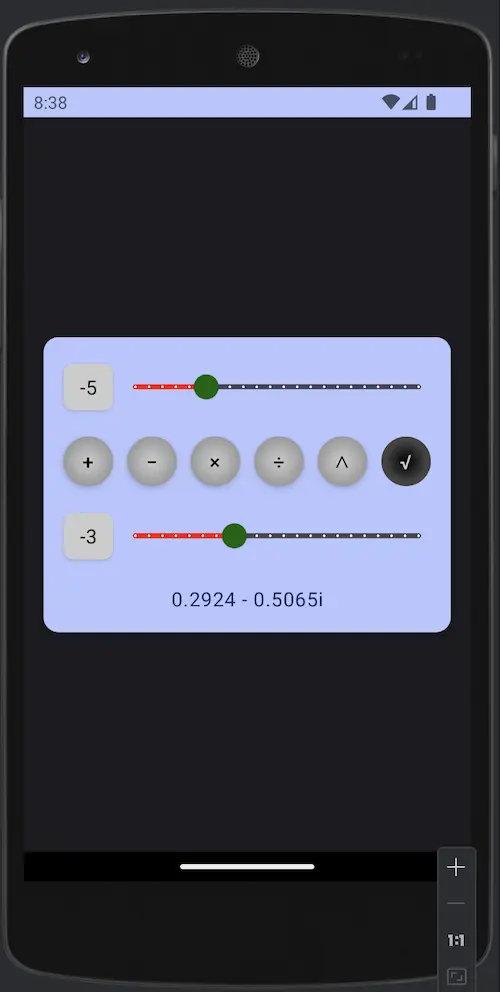

# Android Benchmark
A benchmark to integrate the latest technologies in android realm altogether.

## Technologies
- [x] Compose (BOM 2023.03.00)
- [x] Kotlin (v1.8.10)
- [x] Hilt (v2.44)
- [x] Mavericks (v3.0.7)
- [x] Unit Test (Junit v5.10.0)
- [x] UI Test (Junit v4.13.2)
- [x] Jacoco (v0.8.11)

## Pages
### CalculatorView
Basic integer calculator, extended to the complex numbers realm.

## App Preview

## Todo
- [ ] Github Actions
  - [ ] Main Branch Release Build and Tag
  - [ ] Develop Branch Debug Build
  - [ ] Report Badges
- [ ] Networking (GraphQL/Retrofit)
- [ ] Room
- [ ] Compose Animations
- [ ] Compose Gestures
- [ ] Compose Accessibility
- [ ] Native C++
