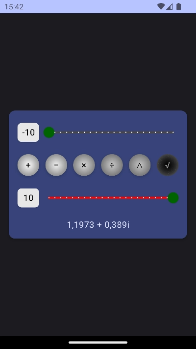

# Android Benchmark
A benchmark to integrate the latest technologies in android realm altogether.

## Technologies
- [x] Compose (BOM 2023.03.00)
- [x] Kotlin (v1.8.10)
- [x] Hilt (v2.44)
- [x] Mavericks (v3.0.7)
- [x] Unit Test (Junit v5.10.0)
- [x] UI Test (Junit v4.13.2)
- [x] Kover (v0.7.4)
- [x] Jacoco (v0.8.11)
- [x] Google Splashscreen API (v1.0.1)

# Screenshots
The screenshots are automatically captured, resized and compressed from the instrumented testes.

## Splashscreen


## Calculator
Basic integer calculator, extended to the complex numbers realm.
 


# Code Quality
## Test Results ✅
### Unit Tests 💯

### UI Tests 💯


## Test Coverage 👍
### Kover Report 💯

### Jacoco Report


# Scripts
Some Unix scripts for the CI/CD and to make the screenshot capturing automatic.
Run the scripts from the project root directory.

## `take-screenshots.sh`
<!-- - Edit `adb` and `JAVA_HOME` in the script to the  -->
For the first time, set your `adb` and `JAVA_HOME` for `jdk-17` into the `env` file. Similar this on OSX:
```sh
rm -f scripts/env
echo 'adb=/Users/payam1991gr/Library/Android/sdk/platform-tools/adb' >> scripts/env
echo 'JAVA_HOME=/Applications/Android Studio.app/Contents/jbr/Contents/Home' >> scripts/env
```

From now on
- Run an android emulator device
- Run the script
```sh
./scripts/take-screenshots.sh
```
The results are stored in the `./docs/screenshots` directory.

❌ Don't put anything inside the `./docs/screenshots` folder. It would be cleaned-up everytime you call the `take-screenshots.sh` script.

## Todo
- [ ] Github Actions
  - [x] Main Branch Release Build and Tag
  - [ ] Develop Branch Debug Build
  - [ ] Report Badges
- [ ] Networking (GraphQL/Retrofit)
- [ ] Room
- [ ] Compose Animations
- [ ] Compose Gestures
- [ ] Compose Accessibility
- [ ] Native C++
